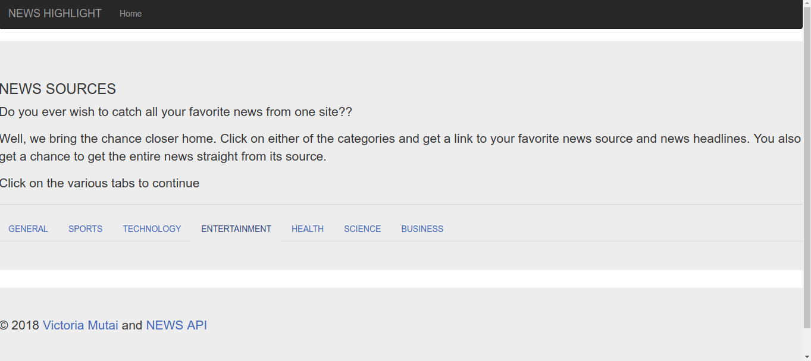

# NEWS HIGHLIGHT
#### News highlight is an application that gets information from newsapi and pulls, sources and top headliness. It also allows users to go to the original news source and get full information.
#### By ****Victoria Cherotich Mutai****

It allows you to click on the category of news tab, then select your desired source from a list and it directs you to the articles source

## Requirements
* Browser
* Good internet connection

## How to use
* Open the site - link [here](https://github.com/VickyMutai/NewsHighlight)
* Click on favorite category.
* A list appears, choose your favorite news source.
* All articles on that category and news source appear.
* A short description is given. For more information click on the link.

## Technologies used

This is a flask application:
* HTML
* CSS
* Python

Hosted on HEROKU

## Meta

Email me at - [Victoria Mutai](vicky.mutai96@gmail.com)
 
Github - [VickyMutai](https://github.com/VickyMutai)

### License
This is an open source software therefore the license is [MIT](https://choosealicense.com/licenses/mit/)
 
Copyright (c) 2017 **Legacy Softwares**